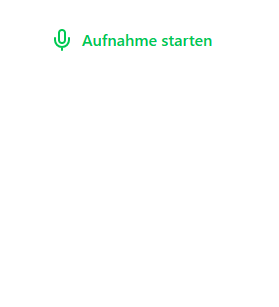
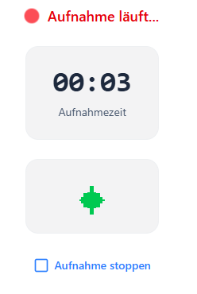
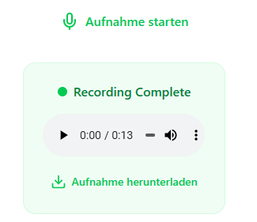

# Audio Recorder (Nuxt Module)


Audio Recorder is a powerful Nuxt.js module that provides advanced audio recording, processing, and management capabilities for web applications. This module includes Vue components, composables, and utilities for seamless audio recording integration with client-side storage and audio format conversion.

<div align="center">
  
  
  
</div>

## Features

- **Audio Recording**: Web-based audio recording with AudioWorklet and PCM capture
- **Audio Visualization**: Real-time audio visualization during recording
- **Session Management**: Persistent audio session storage with IndexedDB
- **Audio Conversion**: FFmpeg integration for PCM to MP3 conversion and concatenation
- **Chunked Recording**: Configurable chunk intervals for efficient storage management
- **Storage Services**: Client-side audio chunk storage with ArrayBuffer for optimal performance
- **Session Explorer**: Browse and manage recorded audio sessions
- **Abandoned Recording Recovery**: Automatic detection and recovery of interrupted recordings
- **iOS Support**: Improved background recording support for iOS devices
- **Internationalization**: Built-in i18n support (English and German)

## Technology Stack

- **Framework**: [Nuxt.js](https://nuxt.com/) module with Vue 3
- **Package Manager**: [Bun](https://bun.sh/)
- **Audio Processing**: [FFmpeg](https://github.com/ffmpegwasm/ffmpeg.wasm) WebAssembly
- **Database**: [Dexie](https://dexie.org/) for IndexedDB management
- **Animation**: [Motion-V](https://motion-v.netlify.app/) for smooth UI transitions
- **Testing**: Playwright for e2e testing

## Setup

### Prerequisites

- Node.js 18+
- Bun package manager
- Modern browser with MediaRecorder API support

### Installation

Install the module to your Nuxt application:

```bash
bun add git+https://github.com/DCC-BS/audio-recorder.bs.js#v1.1.0
```
replace `v1.1.0` with the latest version tag: 

Add it to your `nuxt.config.ts`:

```ts
export default defineNuxtConfig({
    modules: [
        '@dcc-bs/audio-recorder.bs.js',
    ],
})
```

under the vite config in `nuxt.config.ts` configure dexie:
```ts
vite: {
    resolve: {
        alias: {
            dexie: "dexie/dist/dexie.mjs",
        },
    },
}
```

add the following line to your main CSS file:
```css
@import '@dcc-bs/audio-recorder.bs.js';
```

## Usage

### Basic Audio Recording

```vue
<template>
  <div>
    <AudioRecorder 
      :show-result="true"
      :auto-start="false"
      :store-to-db-interval="30"
      :logger="customLogger"
      @recording-started="onRecordingStarted"
      @recording-stopped="onRecordingStopped"
    />
  </div>
</template>

<script setup>
function customLogger(message) {
  console.log('[AudioRecorder]:', message)
}

function onRecordingStarted(stream) {
  console.log('Recording started:', stream)
}

function onRecordingStopped(audioBlob, audioUrl) {
  console.log('Recording stopped:', { audioBlob, audioUrl })
}
</script>
```

### Using Audio Recording Composable

```vue
<script setup>
import { useAudioRecording, useAudioSessions } from '@dcc-bs/audio-recorder.bs.js'

const { 
  startRecording, 
  stopRecording, 
  recordingTime,
  isRecording,
  audioUrl,
  error
} = useAudioRecording({
  storeToDbInterval: 30, // Store chunks every 30 seconds
  logger: console.log,
  onRecordingStarted: (stream) => {
    console.log('Recording started')
  },
  onRecordingStopped: (audioBlob, audioUrl) => {
    console.log('Recording completed')
  },
  onError: (error) => {
    console.error('Recording error:', error)
  }
})

const { getMp3Blob, abandonedRecording, deleteAbandonedRecording } = useAudioSessions({
  deleteOldSessionsDaysInterval: 7,
  logger: console.log
})

// Start recording
await startRecording()

// Stop recording
await stopRecording()

// Download recorded audio as MP3 from a session
async function downloadAudio(sessionId) {
  const blob = await getMp3Blob(sessionId)
  if (blob) {
    const url = URL.createObjectURL(blob)
    const a = document.createElement('a')
    a.href = url
    a.download = `recording-${Date.now()}.mp3`
    a.click()
    URL.revokeObjectURL(url)
  }
}
</script>
```

### Audio Session Explorer

```vue
<template>
  <AudioSessionExplorer />
</template>
```

## Components

### AudioRecorder

The main recording component with start/stop controls and audio visualization.

#### Props

| Property | Type | Default | Description |
|----------|------|---------|-------------|
| `showResult` | `boolean` | `true` | Whether to show the playback section after recording is complete |
| `autoStart` | `boolean` | `false` | Automatically start recording when the component is mounted |
| `storeToDbInterval` | `number` | `5` | Interval in seconds to store audio chunks to IndexedDB (e.g., 30 for 30 seconds) |
| `logger` | `(msg: string) => void` | `undefined` | Optional custom logging function for debugging |

#### Events

| Event | Parameters | Description |
|-------|------------|-------------|
| `recording-started` | `stream: MediaStream` | Emitted when recording starts successfully |
| `recording-stopped` | `audioBlob: Blob, audioUrl: string` | Emitted when recording stops with the audio data |

#### Exposed Methods & Properties

The component exposes the following methods and reactive properties via template refs:

| Property/Method | Type | Description |
|-----------------|------|-------------|
| `isRecording` | `Ref<boolean>` | Reactive boolean indicating if recording is in progress |
| `startRecording` | `() => Promise<void>` | Method to start audio recording |
| `stopRecording` | `() => Promise<void>` | Method to stop audio recording |
| `recordingTime` | `Ref<number>` | Recording time in seconds |
| `formattedRecordingTime` | `ComputedRef<string>` | Formatted recording time as "MM:SS" |
| `error` | `Ref<string \| null>` | Current error message, if any |
| `audioUrl` | `Ref<string \| null>` | URL of the recorded audio blob |

#### Usage with Template Ref

```vue
<script setup lang="ts">
import { ref, computed } from 'vue';
import type { AudioRecorder } from '#components';

const recorderRef = ref<typeof AudioRecorder>()

const isRecording = computed(() => recorderRef.value?.isRecording)
const formattedTime = computed(() => recorderRef.value?.formattedRecordingTime)

function startRecording() {
  recorderRef.value?.startRecording()
}

function stopRecording() {
  recorderRef.value?.stopRecording()
}
</script>

<template>
  <div>
    <AudioRecorder ref="recorderRef" />
    <button @click="startRecording">Start</button>
    <button @click="stopRecording">Stop</button>
    <p>Recording: {{ isRecording }}</p>
    <p>Time: {{ formattedTime }}</p>
  </div>
</template>
```

### AudioVisualizer

Real-time audio waveform visualization component that displays frequency data as animated bars.

#### Props

| Property | Type | Required | Description |
|----------|------|----------|-------------|
| `stream` | `MediaStream \| undefined` | Yes | The audio stream to visualize |
| `isRecording` | `boolean` | Yes | Whether recording is currently active (controls visualization updates) |

#### Events

This component does not emit any events.

#### Exposed Methods & Properties

This component does not expose any methods or properties via `defineExpose`.

#### Usage

```vue
<script setup lang="ts">
import { ref } from 'vue'

const audioStream = ref<MediaStream>()
const recordingState = ref(false)

// Get stream from getUserMedia or other source
navigator.mediaDevices.getUserMedia({ audio: true })
  .then(stream => {
    audioStream.value = stream
    recordingState.value = true
  })
</script>

<template>
  <div>
    <AudioVisualizer 
      :stream="audioStream" 
      :is-recording="recordingState" 
    />
  </div>
</template>
```

#### Technical Details

- Uses Web Audio API with `AudioContext` and `AnalyserNode`
- FFT size: 256 for frequency analysis
- Updates visualization every 50ms when recording
- Displays 25 frequency bars (mirrored for visual symmetry)
- Automatically cleans up audio context when recording stops
- Responsive design with bars scaling based on frequency amplitude

### AudioSessionExplorer

Browse and manage audio sessions component.

- **AudioRecorder**: Main recording component with start/stop controls
- **AudioVisualizer**: Real-time audio waveform visualization
- **AudioSessionExplorer**: Browse and manage audio sessions

## Development

Start the development playground:

```bash
bun dev
```

Build the module:

```bash
bun dev:build
```

Prepare the development environment:

```bash
bun dev:prepare
```

## Testing

Run unit tests:

```bash
bun test
```

Run tests with coverage:

```bash
bun test:coverage
```

Run end-to-end tests:

```bash
bun test:e2e
```

Run tests in watch mode:

```bash
bun test:watch
```

## Code Quality

Format code with Biome:

```bash
bun lint
```

Run linting and fixes:

```bash
bun check
```

## Architecture

### Recording Pipeline

The module uses a modern AudioWorklet-based architecture for high-quality PCM audio capture:

1. **AudioWorklet PCM Capture**: Raw PCM audio data is captured using a custom AudioWorkletProcessor (`pcm-recorder-worklet.js`)
2. **Chunked Storage**: PCM data is accumulated in memory and periodically converted to MP3 chunks using FFmpeg.wasm
3. **IndexedDB Persistence**: MP3 chunks are stored as ArrayBuffers in IndexedDB for efficient storage
4. **Final Concatenation**: On recording completion, all MP3 chunks are concatenated into a single MP3 file

This architecture provides:
- **Lower memory footprint** compared to MediaRecorder blob accumulation
- **Better iOS compatibility** with AudioWorklet support
- **Flexible chunk intervals** for customizable storage patterns
- **Direct MP3 output** without intermediate WebM files

### Database Schema

**AudioSession**: Tracks recording metadata
- `id`, `name`, `createdAt`, `chunkCount`, `totalSize`
- `chunkIds`: Array maintaining chunk order
- `sampleRate`, `numChannels`: PCM metadata for reconstruction

**AudioChunk**: Stores MP3 audio chunks
- `id`, `sessionId`, `createdAt`
- `buffer`: ArrayBuffer containing MP3 data

## Project Structure

- `src/`: Main module source code
  - `module.ts`: Nuxt module entry point
  - `runtime/`: Runtime components and composables
    - `assets/`: AudioWorklet processor files
    - `components/`: Vue components for audio recording
    - `composables/`: Audio recording composables and FFmpeg integration
    - `services/`: Audio storage and database services
    - `utils/`: Utility functions for microphone handling and PCM processing
    - `lang/`: Internationalization files
- `playground/`: Development playground and examples
- `tests/`: Unit and integration tests
  - `e2e/`: End-to-end tests with Playwright
  - `nuxt/`: Nuxt-specific tests

## Release

To release a new version:

```bash
bun release
```

This will run linting, tests, build the module, generate changelog, and push with tags.

## License

[MIT](LICENSE) © Data Competence Center Basel-Stadt

<a href="https://www.bs.ch/schwerpunkte/daten/databs/schwerpunkte/datenwissenschaften-und-ki"></a>

Datenwissenschaften und KI <br>
Developed with ❤️ by DCC - Data Competence Center
